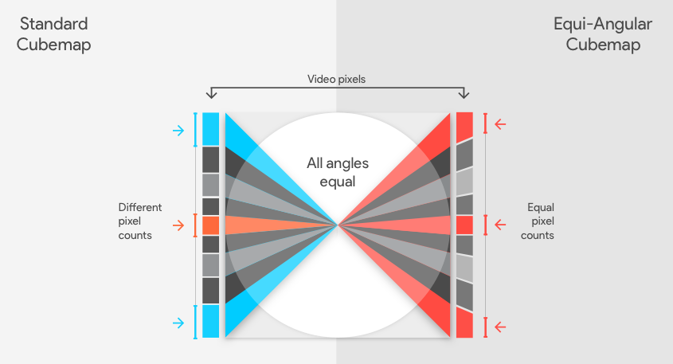
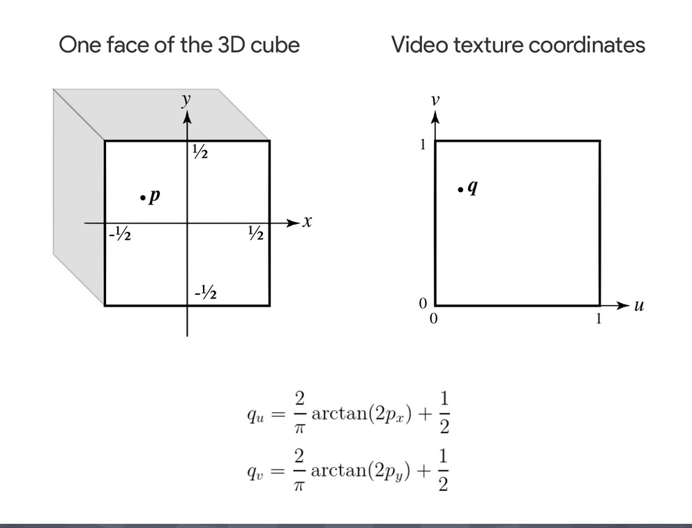
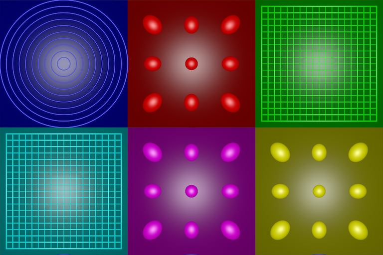
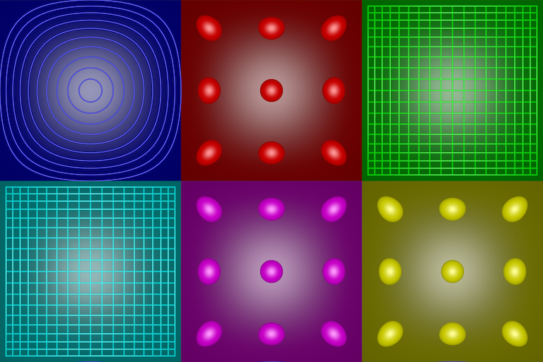
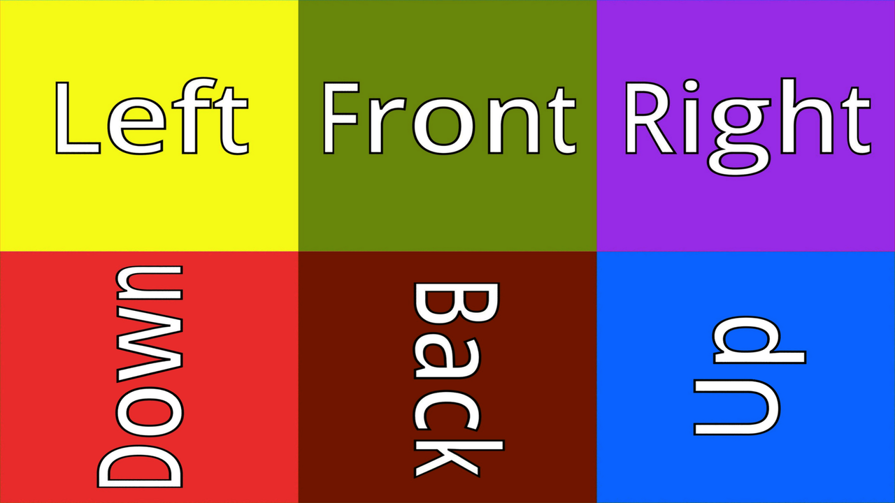

## Convert an Equirectangular image to an Equi-Angular compact cubemap image


360-degree cameras convert a spherical image into an omnidirectional planar image called an equirectangular projection. The poles of the spherical image are mapped to the top and bottom edges and are stretched to the entire width of the planar image. As such, this type of projection contains a lot of redundant pixels amd distortions around the poles. The equator of the spherical image which corresponds to the area around the horizontal middle part of the planar image has relatively fewer pixels. There is also a higher distortion at the equatorial regions. The equatorial region normally contains contents of interest to the viewer.

Ordinary cubemaps which are projected from a spherical image onto the 6 faces of a cube, on the other hand, are much better. There are less redundancy at the poles but more pixels are used at the corners of the cube than in the centre. This is due to the tan() relationship between the angle and distance along the cube faces (see left side of diagram below).




A better distribution of the pixels across the cube face can be obtained for equal angular change using an equi-angular Cubemap projection (see right side of diagram above).

The trick is to re-map the pixels of a face of an ordinary cubemap texture using the *tan()* formula. Given below is a diagram indicating how this might be done.



Translation to GLSL.

```glsl

in vec2 texCoords;

// incoming texture coords (labelled qu and qy in the diagram) are
//  those of the video texture or a face of Equi-Angular Cubemap (EAC).
// The operations are reversed of that presented in the diagram.
void main() {
    // 2*px = tan(π/2.0 * (qu - 0.5));
    // 2*py = tan(π/2.0 * (qy - 0.5));
    // Range of texCoords (given by qu, qy in the diagram):
    //  Initial: [0.0, 1.0] for both texCoords.x and texCoords.y.
    //  (texCoords - 0.5) --> [-0.5, 0.5]
    // Multiply by π/2 --> [-π/4, π/4]
    // Taking the tangent --> [-1.0, 1.0]
    vec2 uv = tan(PI / 2.0 * (texCoords - 0.5));
    // Dividing by 2.0 --> [-0.5, 0.5]
    uv = uv/2.0;

    // If the target range of uv is [-1.0, 1.0], skip dividing by 2.0.
    // more statements follows
}
```

Alternatively, the fragment shader could be coded as:

```glsl

in vec2 texCoords;

void main() {
    // Range of uv: [0.0, 1.0] --> [-1.0, 1.0]
    vec2 uv = texCoords*2.0 - 1.0;
    // Multiply by π/4:
    // [-1.0, 1.0] --> [-π/4, π/4]
    // Taking the tangent:
    // [-π/4, π/4] --> [-1.0, 1.0]
    uv = tan(uv * PI/4.0);

    // If the target range of uv is [-0.5, 0.5], then divide by 2.0.
    // more statements follows
}
```

In order to project the equirectangular map onto a compact equi-angular cubemap (EAC), 

a) the former image is converted into an ordinary cubemap with six 2D sub-textures,
<br />
b) each face of this cubemap is mapped onto a face of an (empty) EAC, and finally,
<br />
c) the EAC is converted into a compact cubemap.
<br />
<br />

Steps (a), (b) and (c) are executed by calling the Objective-C methods in sequence:

```objc
    createCubemapTexture:withFaceSize:
    createEACTextureWithTexture:withFaceSize:
    createCompactmapTextureWithEACTexture:withResolution:
```

The initial equirectangular texture can be created by loading 8-bit or 16-bit images. Subsequent textures created have an OpenGL internal format of 32-bit floats if the demo is run on macOS. iOS' OpenGLES does not support 32-bit floats so these subsequent textures have an internal format of 16-bit half floats.

Note: while the faces of a cubemap texture must be squares, their common size need not be POT (powers-of-two). 


The demo allows the user to save the final texture (a compact cubemap in the form of a 2D image) either as a .hdr or .png file. The user must set the *saveAsHDR* correctly (cf viewDidLoad method of the ViewController).

<br />
<br />

Outputs:



The above graphic is produced by passing an ordinary cubemap texture to the create compact map method

```objc
    createCompactmapTextureWithEACTexture:withResolution:
```

With an EAC texture, the output produced is as follows:




The resolution of the compact map was for the first two output was set with the statement:
```objc
    CGSize resolutionEAC = CGSizeMake(3*faceSize, 2*faceSize);
```

If the ratio of the desired resolution is 16:9, it can be changed to:
```objc
    CGSize resolutionEAC = CGSizeMake(3*1280, 3*1280*9.0/16.0);
```

This will produce a graphic of dimensions 3840 pixels (width) by 2160 pixels (height) i.e. a ratio of 16:9.




**Requirements:** XCode 9.x, Swift 4.x and macOS 10.13.4 or later.
<br />
<br />

**References:**

a) http://paulbourke.net/panorama/cubemaps/

    "Pixel efficiency considerations"

b) https://www.googblogs.com/2017/03/page/29/

c) https://blog.google/products/google-ar-vr/bringing-pixels-front-and-center-vr-video/
